 

 

 

 

 

 

Levantamos el servicio:

 

Lo encuentra

Este no lo encuentra y lo intercepta el Middleware

**Lesson 2: Customizing Controllers and Actions**

**Demonstration: Creating Asynchronous Actions**

 

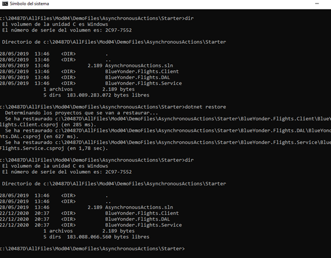

Levantamos el servicio:

 

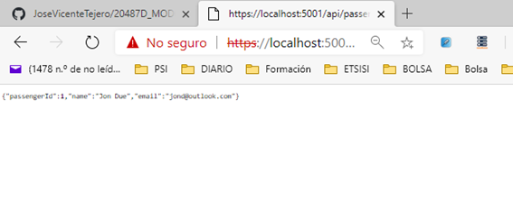

 

Borramos el certificado en el servidor

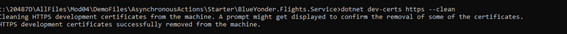

 

Lo creamos de nuevo

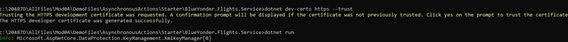

 

 

Creamos el certificado en el cliente y ejecutamos.

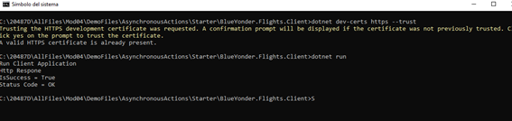

 

Comprobamos que la imagen está creada

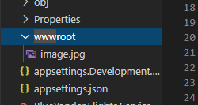

 

\# Lesson 3: Injecting Dependencies into Controllers

 

\### Demonstration: Using Dependency Injection with Controllers

 

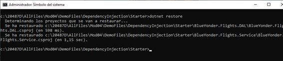

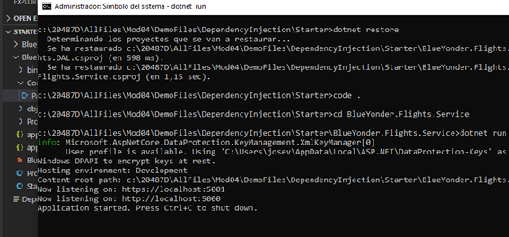

 

 

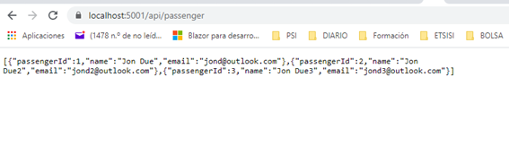

 

### L2 - Creating Custom Filters and Formatters

 

\>20487D_MOD04_DEMO_CustomFiltersFormatters

 

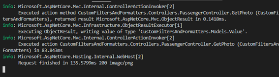

 

 

 

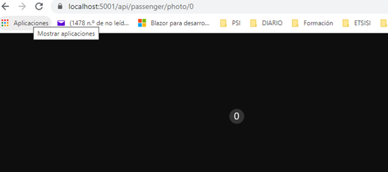